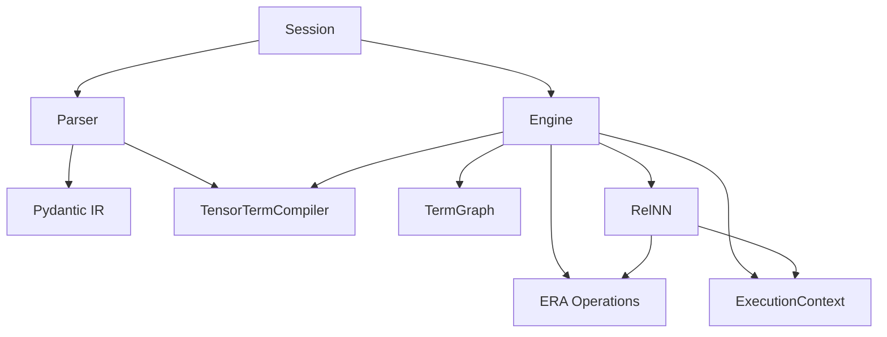

# Architecture Redesign Proposals for RelNN

## Current Architecture (as-is)



The system has a clean DSL-to-execution pipeline, but several design problems have accumulated as features (templates, bounded sets, HGT) were added.

---

## Problem 1: Engine is a God Class (2,500 lines, 10+ responsibilities)

`engine.py` currently owns:

- **Symbol table** (scoped lookup, namespaces)
- **Term graph management** (creating/wiring term graphs)
- **Template specialization** (registration, dispatch, materialization, caching)
- **Bounded-set expansion** (guard relations, condition ranges)
- **Tensor term compilation** (delegating to `TensorTermCompiler`)
- **Parameter store** (FQN building, extraction, save/load)
- **Training loop** (optimizer, loss, epoch loop, early stopping)
- **Prediction** (subgraph, forward pass)
- **Arithmetic evaluation** (two separate evaluators)
- **External symbol resolution** (frame introspection, torch.nn lookup)
- **DB normalization** (relation normalization to `EmbeddedRelation`)

This makes the Engine nearly impossible to test in isolation, hard to reason about, and brittle to change.

### Proposed split

| New module | Responsibility | Source lines (approx) |
|---|---|---|
| `symbol_table.py` | `SymbolTable` class: scoped lookup, namespace push/pop, symbol registration | ~80 lines from Engine |
| `template_dispatch.py` | `TemplateRegistry`: registration, pattern matching, specialization dispatch, instance caching, materialization | ~450 lines from Engine |
| `bounded_expansion.py` | `expand_bounded_set()` and helpers: guard-relation expansion, condition-range expansion | ~200 lines from Engine |
| `parameter_store.py` | `ParameterStore`: FQN building, extraction, save/load, `_resolve_transform_def_name_from_node` | ~200 lines from Engine |
| `training.py` | `fit()`, `predict()`, optimizer/loss creation, epoch loop | ~300 lines from Engine |
| `arith_eval.py` | `evaluate_arith_term()` — single unified evaluator (merge the two current versions) | ~60 lines from Engine |
| `engine.py` (slimmed) | Orchestrator: owns the pipeline (`add_program` -> graph build -> compile -> fit/predict), delegates to the above | ~800 lines |

**Key constraint:** This is a pure internal refactor. The `Session` API (`define`/`run`/`fit`/`predict`) does not change. Tests stay the same.

---

## Problem 3: RelNN <-> Engine circular coupling

RelNN calls private Engine methods (`_build_param_fqn`, `_resolve_transform_def_name_from_node`) and reads `engine.parameter_store`. Engine calls `term_graph_to_module(graph, engine=self)`, creating a bidirectional dependency.

### Proposed fix

Define a `ParameterProvider` protocol that RelNN depends on (not the full Engine):

```python
class ParameterProvider(Protocol):
    def load_parameters(self, node_id: str, module: nn.Module) -> None: ...
    def save_parameters(self, node_id: str, module: nn.Module) -> None: ...
```

Engine implements this protocol. RelNN receives a `ParameterProvider` (or `None`) instead of `engine`. This cuts the circular import and makes RelNN testable with a mock provider.

---

## Problem 5: TermGraph.add_rule() is a 180-line god method

`add_rule()` handles: redefinition checks, RHS resolution, data loader creation, Zero node insertion, Join/Union creation, Selection, Transformation, Aggregation extraction, OrderBy, and symbol alias registration — all in one method.

### Proposed fix

Extract into focused helpers (all staying on `TermGraph`):

```
add_rule(rule)
  -> _resolve_rhs_inputs(rule.rhs)       # data loaders, function calls, zero nodes
  -> _build_relational_node(inputs)       # join or union node
  -> _build_selection_node(node, filters) # selection if needed
  -> _build_transformation_node(node, lhs) # tensor term + var mapping
  -> _build_aggregation_node(node, agg)   # aggregation if needed
  -> _register_symbol(lhs.name, node)     # alias
```

Each helper is ~20-30 lines and independently testable.

---

## Problem 6: Duplicate `get_aggregation_function`

Two separate implementations exist:
- `term_graph.py` lines 65-74
- `era_operations.py` lines 813-823

### Proposed fix

Keep one in `era_operations.py` (where the scatter functions live), import it in `term_graph.py`.

---

## Problem 7: Duplicate arithmetic evaluation

Engine has two evaluators:
- `_evaluate_arith_term` (line 523) — used during compilation
- `_evaluate_arith_term_with_resolver` (line 1829) — used by Selection at runtime

### Proposed fix

Merge into a single `evaluate_arith_term(term, resolver=None)` in `arith_eval.py`. The resolver parameter makes the runtime version a specialization of the compile-time version.

---

## Problem 8: `EmbeddedRelation` name collision

`pydantic_classes.EmbeddedRelation` (AST/IR node representing a relation reference in a rule) and `embedded_relation.EmbeddedRelation` (runtime data: DataFrame + tensors) share the same name, causing confusion throughout the codebase.

### Proposed fix

Rename the Pydantic one to `ERRef` (it already has `ERRef` defined but unused at line 50). Update `pydantic_classes`, `parser`, `engine`, and `term_graph` to use `ERRef`. The runtime `EmbeddedRelation` keeps its name since it's the public-facing data type.

---

## Problem 9: Parser mixes syntax transformation with semantic validation

`parser.py`'s `RelnnTransformer` does AST construction AND calls `resolve_op` / `tensor_term_to_arith_term` during parsing. This couples parsing to the compiler and engine.

### Proposed fix (lighter touch)

This is lower priority and more invasive. A reasonable first step: extract the `transform_def` normalization (lines 711-784) and `fix_tensor_term` into a post-parse IR normalization pass that runs after the Lark transformer returns, rather than inside it. This decouples the parser from the compiler.

---

## Problem 10: `full_seed(42)` at Session import time

`session.py` calls `full_seed(42)` at module import, which silently sets global RNG state for any code that imports Session.

### Proposed fix

Remove the import-time call. Make seeding explicit: `Session.__init__(seed=42)` already calls `full_seed` if a seed is provided. Remove the module-level call.

---

## Execution Order and Risk Assessment

| Priority | Proposal | Risk | Effort |
|---|---|---|---|
| 1 | Extract `ParameterStore` from Engine | Low — clear boundary, tests exist | Small |
| 2 | Extract `SymbolTable` from Engine | Low — isolated state | Small |
| 3 | Split `add_rule` into helpers | Low — same class | Small |
| 4 | Deduplicate `get_aggregation_function` | Trivial | Trivial |
| 5 | Merge arithmetic evaluators | Low | Small |
| 6 | Rename Pydantic `EmbeddedRelation` to `ERRef` | Medium — wide rename | Medium |
| 7 | Extract `TemplateRegistry` from Engine | Medium — complex logic | Medium |
| 8 | Extract `BoundedExpansion` from Engine | Medium — depends on template | Medium |
| 9 | Extract `training.py` from Engine | Medium — touches fit/predict | Medium |
| 10 | Decouple parser from compiler | Medium — parser internals | Medium |
| 11 | Remove import-time seeding | Trivial | Trivial |

Items 1-5 and 11 can be done incrementally with no risk. Items 6-9 require careful testing. Item 10 (parser decoupling) is more invasive.

---

## What stays the same

- The DSL grammar and syntax
- The `Session` public API
- The two-phase `instantiate`/`forward` execution model
- The row-first tensor convention and smart ops
- The nbdev workflow (notebooks remain source of truth)
- The `scaffold.py` comparison infrastructure (orthogonal to core)
- The `optimizations.py` graph rewriting framework (orthogonal to core)
