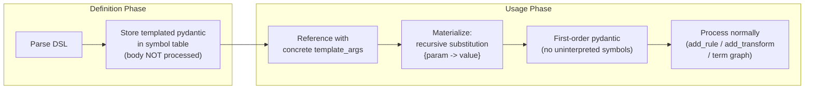

# Template Parameters for RelNN

## Design Decisions (confirmed with user)

- **Scope**: TransformDef, FunctionDef, and Rule can all have template params
- **Param kinds**: Both scalars (int/float/bool/str) and ER references
- **Type annotations**: Untyped for now (`<a, b, c>`) -- no `:int` / `:ER(...)` syntax
- **Instantiation syntax**: Inline only -- e.g. `GCN<16,32>(Papers, Citation)(pid; z)`
- **Weight sharing**: Same template + same args = shared weights (like TransformDef sharing today)
- **Rule templates**: `Layer<64>(pid; z)` in a RHS triggers materialization of the templated rule
- **ER template params**: Replace ER names in body at compile-time; distinct from er_params (runtime data)

## Architecture

The core mechanism is a **materialization function** that recursively substitutes template params in a pydantic tree:



### Key implementation pieces

1. **`materialize_pydantic(obj, substitution_dict)`** in `parent/engine.py`: Deep-copy + recursive substitution. Handles:
   - `Var.name` matching a template param -> replace with concrete value
   - `EmbeddedRelation.name` matching a template param -> replace ER name (for ER template params)
   - `ArithTerm.value` that is a `Var` matching a template param -> replace with concrete value
   - Lists, nested BaseModels -> recurse

2. **`add_transform`** change: If `template_params` is set, store in symbol table but skip processing. Current code at line 586 raises `NotImplementedError`.

3. **`add_function`** change: If `template_params` is set, store in symbol table but skip body processing. Current code at line 766 raises `NotImplementedError`.

4. **`add_rule`** change: If `lhs.template_params` is set, store in symbol table but skip term graph addition. Current code at line 184 raises `NotImplementedError`.

5. **`replace_all_vars_in_tg_using_symbol_table`** in `parent/engine.py` (line 803): Extend to handle `VarTemplated` -- when a `TensorTerm.value` is `VarTemplated`, look up the templated TransformDef, materialize, return resolved tensor_term.

6. **`add_rule` RHS resolution**: When an `EmbeddedRelation` in the RHS has `template_args`, look up the templated entity (Rule or FunctionDef), materialize with the args, and process the result. This parallels the existing `_materialize_function_call` logic.

7. **Template instance cache** on Engine: `Dict[str, materialized_entity]` keyed by `"Name<arg1,arg2,...>"` to enable weight sharing for identical instantiations.

### Files to modify

- `parent/engine.py` / `nbs/021_engine.ipynb` -- Main changes (materialization, add_* methods, symbol resolution)
- `parent/pydantic_classes.py` / `nbs/002_pydantic_classes.ipynb` -- No changes needed (fields already exist)
- `parent/relann_grammar.lark` -- No changes needed (template_params/args already in grammar)
- `parent/parser.py` / `nbs/003_parser.ipynb` -- No changes needed (already parses templates)

### Test files to create

- `nbs/tests/feature/test_template_params.py` -- Feature tests for template materialization at the pydantic/engine level
- `nbs/tests/smoke/test_template_smoke.py` -- End-to-end smoke tests (Session.run with templates, verify shapes)

## Phase 1: Tests (TDD)

### A. Feature tests (`test_template_params.py`)

**TransformDef templates:**

- `test_templated_transformdef_stored_in_symbol_table` -- Define `Lin<d> = Linear(d, d, False) .`, verify it's stored with template_params
- `test_templated_transformdef_not_processed_until_instantiated` -- Verify no term graph node created at definition time
- `test_templated_transformdef_materialized_via_var_templated` -- Use `Lin<64>(z)` in a rule, verify it resolves to `Linear(64, 64, False)(z)`
- `test_templated_transformdef_wrong_arg_count_raises` -- `Lin<64,32>` when only 1 param expected
- `test_templated_transformdef_weight_sharing_same_args` -- Two uses of `Lin<64>` share weights

**FunctionDef templates:**

- `test_templated_functiondef_stored_in_symbol_table` -- Define `def GCN<h,d>(Papers, Citation): ... enddef`, verify storage
- `test_templated_functiondef_body_not_processed_until_instantiated` -- No function namespace term graph until call
- `test_templated_functiondef_scalar_params_substituted` -- `GCN<16,32>(Papers, Citation)` substitutes h=16, d=32 in body
- `test_templated_functiondef_er_param_substituted` -- `def Model<R>(Papers): ... R(p;) ... enddef` with `Model<Citation>(Papers)`
- `test_templated_functiondef_wrong_arg_count_raises` -- Too many/few template args

**Rule templates:**

- `test_templated_rule_stored_in_symbol_table` -- Define `Layer<d>(pid; Linear(d,d,False)(z)) :- Papers(pid; z) .`, verify storage
- `test_templated_rule_not_added_to_tg_until_instantiated` -- No term graph node at definition
- `test_templated_rule_instantiated_via_rhs_reference` -- `Output(pid; z) :- Layer<64>(pid; z) .` materializes Layer with d=64

### B. Smoke tests (`test_template_smoke.py`)

- `test_templated_transformdef_predict_shape` -- End-to-end: define template TransformDef, use in rule, predict, check shape
- `test_templated_functiondef_predict_shape` -- End-to-end: define template GCN function, call with args, predict
- `test_templated_functiondef_with_er_template_param_predict_shape` -- ER as template param, predict
- `test_templated_rule_predict_shape` -- Templated rule used in RHS, predict
- `test_same_template_different_args_different_weights` -- `Lin<32>` and `Lin<64>` have different param shapes
- `test_same_template_same_args_shared_weights` -- Two uses of `Lin<64>` share the same parameters

## Future Work: Recursive Templates with Base-Case Handling

The current template system supports **compositional templates** — a template whose body
references other templates (e.g. `GCN<d_in, d_hidden, d_out>` that calls
`GCNLayer<d_in, d_hidden>` and `GCNLayer<d_hidden, d_out>` internally).

However, **true recursive templates** — where a template calls itself with modified
arguments and terminates via a base case — are not yet supported. For example:

```
# NOT YET SUPPORTED — requires template specialization / base-case handling
def GCN<L, d_in, d_hidden, d_out>(Nodes, Edges):
    Inner(cited; z) :- GCN<L-1, d_in, d_hidden, d_hidden>(Nodes, Edges)(cited; z) .
    Output(cited; z) :- GCNLayer<d_hidden, d_out>(Inner, Edges)(cited; z) .
enddef

# Base case:
def GCN<1, d_in, d_out>(Nodes, Edges):
    Output(cited; z) :- GCNLayer<d_in, d_out>(Nodes, Edges)(cited; z) .
enddef
```

This requires **template specialization**: the engine must dispatch to different
definitions based on the concrete value of a template argument (similar to C++
partial template specialization). Implementation would need:

1. A mechanism to register multiple definitions for the same template name,
   distinguished by specific argument values (e.g. `GCN<1, ...>` vs `GCN<L, ...>`).
2. A matching/dispatch step during materialization that selects the best-matching
   specialization.
3. A termination check to prevent infinite recursion when no base case matches.

## Phase 2: Implementation

Implement in this order:

1. Core `materialize_pydantic()` function
2. `add_transform` for templated TransformDefs + `VarTemplated` resolution
3. `add_rule` for templated Rules + RHS template_args resolution
4. `add_function` for templated FunctionDefs + function call template_args resolution
5. Template instance cache for weight sharing
6. Sync `parent/` to `nbs/` via `python scripts/sync_parent_to_nbs.py`
