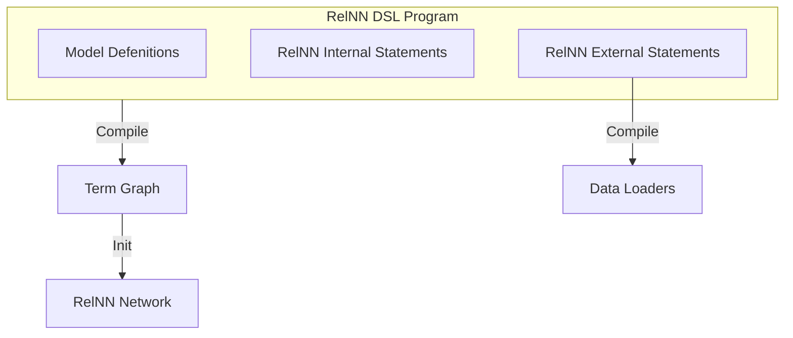
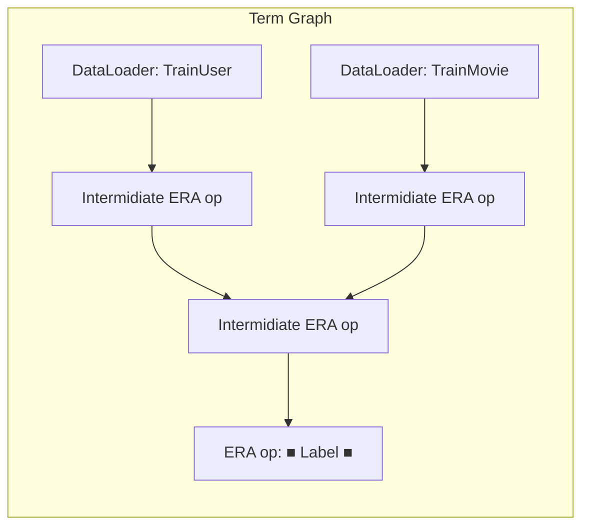
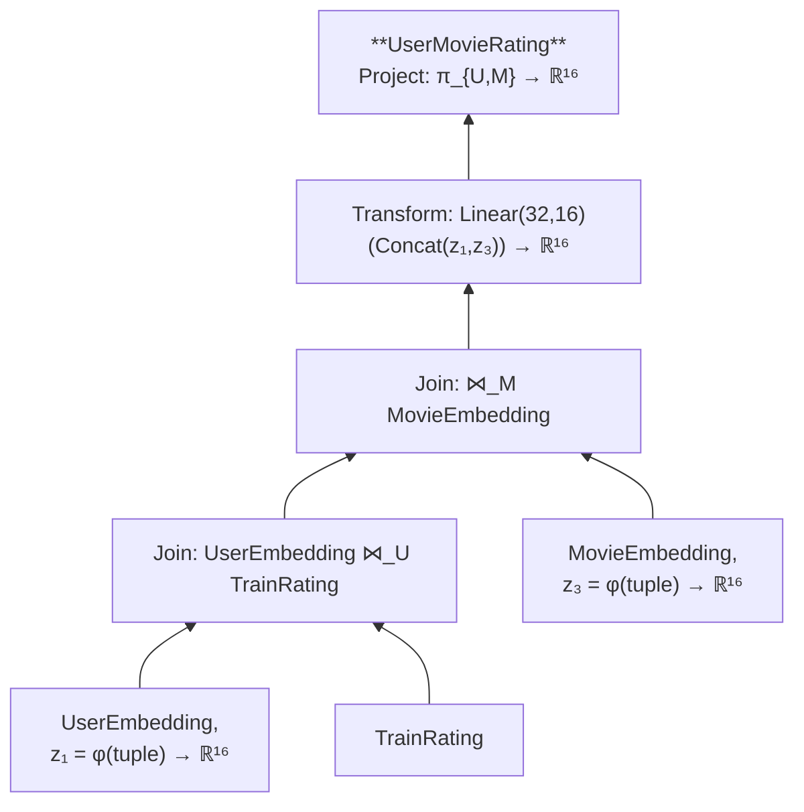
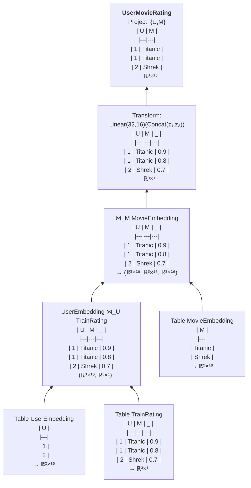

This file contains the story telling of RelNN. From motivation to users, roadmap and more.

# RelNN: A Neural Network Framework for Relational Data

# Motivation
**We aim to bring the same revolutionary impact that SQL had on database access, to the field of neural networks.**

<details>
<summary><b>Why SQL was successful</b></summary>
Before SQL, database access was a complex technical challenge that created significant bottlenecks:

1. **Technical Barrier**: Business users couldn't directly access their data, requiring database engineers to write custom code for every query
2. **Implementation Complexity**: Engineers had to write low-level code dealing with:
   - Physical storage layout navigation
   - Data access pattern optimization
   - Memory management
   - Performance tuning
3. **System Fragmentation**: Each database system had its own unique access methods, making cross-platform development difficult
4. **Resource Drain**: Engineers spent valuable time on repetitive data access tasks instead of higher-value work

This mirrors today's neural network development landscape, where researchers and data scientists must rely on engineers to implement architectures in low-level frameworks.

SQL revolutionized database access by:
- Introducing a declarative language that hides implementation complexity
- Shifting focus from "how to retrieve" to "what to retrieve"
- Creating a universal standard for database operations
- Democratizing data access for non-technical users
- Dramatically reducing code complexity for data operations
</details>

---

We would like to simplify the process of writing neural networks.

<details>
<summary><b>Why Relational Databases</b></summary>
The data is allready there, 40% of the world's data is stored in Relational DB's. In addition, learning on relational databases is a special case of learning on any data structure. Since any data can be represented in relational format, a symbolic language designed for relational databases can be used as a universal framework for learning on any type of data.
</details>

<details>
<summary><b>Boilerplate Code Overhead</b></summary>
When a user wants to create a neural network over relational data, they encounter several problems. There is a large Implementation Gap between knowing which architecture you want to implement, and the implementation itself. There is a lot of boilerplate code that the user needs to write, because the languages we have today (like PyTorch) are too low-level for these tasks.
</details>

<details>
<summary><b>Declarative Neural Network Design</b></summary>
While PyTorch excels as a symbolic engine for defining computation graphs on tensors, it works best when data is already transformed into a homogeneous tensor format. However, real-world data is often heterogeneous and complex. This is where the magic of our "database native" language shines - it allows us to define data structures in a flexible way and then work directly with them, without forcing everything into a rigid tensor format. This flexibility enables users to express complex data relationships and transformations in a clear, declarative manner, making it easier to build and experiment with different neural network architectures.
</details>

---

**Summary**: RelNN bridges the gap between neural network design and implementation by providing a high-level, declarative framework for building neural networks over relational data. Similar to how SQL revolutionized database access, RelNN enables researchers and data scientists to focus on architecture design rather than low-level implementation details. For users who can express their desired neural network architecture (as described in research papers), RelNN handles the boilerplate code implementation, making it as easy to build neural networks as it is to write SQL queries.


## RelNN Users 

RelNN serves two main user groups, each with different needs and expertise levels:

1. **SQL Users & Data Analysts**
   - Users who are familiar with SQL and want to enhance their database operations with neural networks
   - Don't need to be programmers or understand low-level ML frameworks
   - Only need to understand minimal concepts like embeddings to use neural networks with relational data.
   - Can use RelNN declaratively, similar to how they write SQL queries
   - Don't need to deal with boilerplate code, PyTorch, or Python programming

2. **ML Framework Developers & Advanced Users**
   - Users who want to implement specific neural network architectures over relational data
   - Need more control over the implementation details
   - Want to use advanced concepts like GraphSAGE and attention mechanisms
   - Benefit from RelNN by eliminating boilerplate code for parameter management and connection wiring
   - Can express complex embedding relationships between tables in a single statement
   - Similar to how SQL APIs like SAP and APSS work at a high level before transpiling to SQL

Both user groups benefit from RelNN's declarative approach, which allows them to focus on what they want to achieve rather than how to implement it. The framework handles the complex details of connecting neural networks with relational data, making it accessible to users with different levels of technical expertise.

---


## RelNN Lifecycle

<details>
<summary><b>RelNN Lifecycle (Don't open)</b></summary>



Now, we can discuss the lifecycle of the RelNN Network, which is just a regular NN, that also has one more function with the name instantiate (and in the init function it also holds the relevant term graph)

Note: This section only highlights the key differences from standard PyTorch training loops

```python
net, loss_fn = transpile_target_to_nn_Module()
opt = ...

#training
for epoch in epochs:
    for batch in batches:
        opt.zero_grad()
        data, labels = data_loader.next(), label_loader.next()
        # Note: this will be cached since it wont change between epochs
        # Step 1: Pre-compute joins and set up computation graph
        net.instantiate(data)
        # Step 2: Execute neural network operations using cached joins
        loss = loss_fn(net.forward(data), labels)
        loss.backward()
        optimizer.step()

#inference
for batch in batches:
    data = data_loader.next()
    # Step 1: Pre-compute joins and set up computation graph
    net.instantiate(data)
    # Step 2: Execute neural network operations using cached joins
    out = net.forward(data)
```
</details>

<!-- ### Agenda from Dean - TODO: implement it

let's see a simple example
program:
    model
    internal
    external (with external symbols)
loss

-> we take this program and convert to term graph

each statment (only part of the nodes have names, other are annonymous)

term graph, leaves are external data (dataloader)
inner nodes are RA
when i init - each leave is now dataloaders (sql commends that load from the dataset). all the leaves are external relations.
each inner node is now a relNN network.
each node is an op in the ERA, some nodes are intermidiate results, some nodes are the lhs of the statmets.

---

most of the statments are defenitions (if def we ).
and we have fit and predict.
if pred we take the subgraph מושרה from the that node we convert all the graph:
-leaves to dataloaders 
-inner to relational neural networks operations in out Embedded Relational-Algebra,
then we do instantiate and forward - backward loop.

now how ERA is defined:
- above embedded relations (take from arch)
ER is (table,(e1,...))
and here are our operators.
mathematical def for each op

now example - that from statment 

run of a term graph is builing of ops.

let's see how a predict to UCE_mb: after init, let's see the instantiate and forward. -->


---

# RelNN Program Example: Movie Rating Prediction

## RelNN Program Example

Here's a simple example of a RelNN program that predicts movie ratings using pre-existing database tables:


```python
# Define the model
model MovieRating(TrainUser:(int,int)⟨0⟩, TrainRating:(int,int,float)⟨0⟩, TrainMovie:(int,int,str)⟨0⟩) -> (1)⟨1⟩:
    # Create embeddings for users and movies
    UserEmbedding(U)⟨[Age],Linear(1,16)⟩ :- TrainUser(U,Age).
    MovieEmbedding(M)⟨[Year,Genre],Linear(2,16)⟩ :- TrainMovie(M,Year,Genre).
    
    # Join user and movie embeddings with ratings
    UserMovieRating(U,M)⟨Concat(z1,z3),Linear(32,16)⟩ :- 
        UserEmbedding(U)⟨z1⟩, TrainRating(U,M,_), MovieEmbedding(M)⟨z3⟩.
    
    # Final prediction
    Rating(U,M)⟨Linear(16,1)⟩ :- UserMovieRating(U,M)⟨z⟩.

# Define loss function using existing TrainRating table
Loss()⟨MSE(z,Score)⟩ :- MovieRating{TrainUser,TrainRating,TrainMovie}(U,M)⟨z⟩, TrainRating(U,M,Score).

# Train the model
Fit By Loss()⟨z⟩.

# Make predictions
Prediction(U,M,⟨z⟩) :- Rating(U,M)⟨z⟩.
```

## Basic RelNN Program Structure

A RelNN program consists of several key components:

1. **Model Definition**
   - Declares input relations and output relation
   - Specifies dimensions and types
   
2. **Definition Statements**
   - External: Connect to database tables/relations
       - Example: `TrainUser(U,Age) -> SQL("SELECT user_id, age FROM TrainUser")`
   - Internal: Define intermediate Relational Embedings using the ERA
       - Example: `UserEmbedding(U)⟨[Age],Linear(1,16)⟩ :- TrainUser(U,Age)`

3. **Special Statements**
   - `Fit`: Trains the model using specified loss function
   - `Predict`: Generates predictions using trained model


## Term Graph Construction and Execution when using `Predict`

Each RelNN statement contributes to building a term graph that represents the neural network structure. The term graph is a directed acyclic graph (DAG) that captures the flow of data and transformations through the relNN network, where nodes represent Embedded Relational-Algebra operations (that we will define later), and edges represent data dependencies between them.

When a `Predict` statement is encountered, the following process occurs:

1. **Subgraph Extraction**: The system identifies the induced subgraph from the term graph that is relevant to the prediction task.

2. **Graph Processing**:
   - Leaf nodes are converted into data loaders
   - Internal nodes are transformed into relational neural network operations using our Embedded Relational-Algebra (ERA)

3. **Execution**:
   - `instantiate()`: Sets up the computation graph and pre-computes joins
   - `forward()`: Executes the neural network operations using the cached joins

---

## Term Graph (general) Structure



The term graph represents the neural network's computation flow:

- **Leaf Nodes**: Data loaders that convert SQL tables into tensor data
  - Example: `TrainUser`, `TrainMovie` tables become data loaders

- **Inner Nodes**: ERA (Embedded Relational Algebra) operations
  - Labeled nodes: Named embedded relations that are outputs of specific operations
  - Anonymous nodes: Intermediate computation steps
  - Example: `UserMovieRating` is a labeled node representing the final output relation

The graph flows from data loaders through ERA operations, with each operation transforming the data and embeddings according to the defined algebra rules.

---

## Data Loaders 
A data loader is a component that loads data from the database into memory, 
for example executing SQL queries like `SELECT * FROM TrainMovie` to fetch movie data for neural network processing.

## Embedded Relational Algebra (ERA) – Formal Definition

The ERA is a mathematical framework that extends classical relational algebra with embeddings, enabling neural network operations over relational data. Each operation preserves differentiability, making it suitable for end-to-end learning.

For each operation in the ERA algebra, we will write down the equations that precisely define its behavior. 

> **Note:** The execution of the term graph is essentially a composition of these equations (where each node's output becomes the input for subsequent operations in the graph).

for each one we have a schema 
for each named node, it happens that the list of embeddings is one.
each node is defining the schema and semantics of it.


* each node, when materialized, returns a **multi-embedded relation**:
    * an ordered pair $\langle R,\;\varphi\rangle$ where:
        * $R \subseteq D_{1}\times\cdots\times D_{n}$ is a classic relation (set of tuples)
        * $\varphi : R \;\longrightarrow\; \mathbb R^{k_{1}}\times\cdots\times\mathbb R^{k_{m}}$ assigns exactly m real-valued embeddings to every tuple
    * one can intuitively think of it as a "(dataframe, tuple of embeddings)".
    * note: its a tuple of tensors and not 1 tensor to support the semantics of our join operation

* the algebra has the following operators with the following semantics:
  * union(agg)
    * takes the union of the relations, and merge embeddings of duplicate lines via agg
    * For relations $R_1$ and $R_2$ with embeddings $\varphi_1$ and $\varphi_2$ respectively:
      * $R_1 \cup R_2 = \{t | t \in R_1 \lor t \in R_2\}$
      * For each tuple $t$ in $R_1 \cup R_2$:
        * If $t$ appears in both $R_1$ and $R_2$: $\varphi(t) = \text{agg}(\varphi_1(t), \varphi_2(t))$
        * If $t$ appears only in $R_1$: $\varphi(t) = \varphi_1(t)$
        * If $t$ appears only in $R_2$: $\varphi(t) = \varphi_2(t)$

  * difference
    * difference of relations, carry the embeddings
    * For relations $R_1$ and $R_2$ with embeddings $\varphi_1$ and $\varphi_2$ respectively:
      * $R_1 - R_2 = \{t | t \in R_1 \land t \notin R_2\}$
      * For each tuple $t$ in $R_1 - R_2$: $\varphi(t) = \varphi_1(t)$

  * project(agg)
    * projects the relation on the given columns. embeddings of rows that are duplicates after projection are merged via agg
    * For relation $R$ with embedding $\varphi$ and projection attributes $A$:
      * $\pi_A(R) = \{t[A] | t \in R\}$
      * For each tuple $t'$ in $\pi_A(R)$:
        * Let $S = \{t | t \in R \land t[A] = t'\}$
        * $\varphi(t') = \text{agg}(\{\varphi(t) | t \in S\})$

  * selection(theta)
    * selects rows of relations, embeddings are carried
    * For relation $R$ with embedding $\varphi$ and condition $\theta$:
      * $\sigma_\theta(R) = \{t | t \in R \land \theta(t)\}$
      * For each tuple $t$ in $\sigma_\theta(R)$: $\varphi(t) = \varphi(t)$

  * join
    * join of relations, embedding of each row is a tuple containing the embedding tuples from each original row that made up the join row
    * For relations $R_1$ and $R_2$ with embeddings $\varphi_1$ and $\varphi_2$ respectively:
      * $R_1 \bowtie R_2 = \{(t_1,t_2) | t_1 \in R_1 \land t_2 \in R_2 \land t_1[A] = t_2[B]\}$
      * For each tuple $(t_1,t_2)$ in $R_1 \bowtie R_2$: $\varphi((t_1,t_2)) = (\varphi_1(t_1), \varphi_2(t_2))$

  * embedding_map(T)
    * Applies a differentiable transformation to the embeddings while preserving the relation structure
    * For relation $R$ with embedding tuple $(E_1,...,E_n)$ and transformation $T$:
      * $R$ remains unchanged
      * For each tuple $t$ in $R$: $\varphi(t) = T(E_1[t],...,E_n[t])$
      * Where $T$ is a differentiable transformation that can be broadcasted across the first axes
    <!-- * in practice, we expect T to be a transformation that is broadcasted 
    across the first axes, allowing us to simply map T over $(E_1,...,E_n)$ to 
    get the new embedding tuple. -->

  * agg(group_attr,relation_aggs,embedding_agg)
    * groups relations based on group attributes, optionally aggregates column attributes, and merges embeddings of grouped rows
    * For relation $R$ with embedding $\varphi$, grouping attributes $A$, and embedding aggregation $G$:
      * $\gamma_{A,G}(R) = \{(t[A]) | t \in R\}$
      * For each group $g$ in $\gamma_{A,G}(R)$:
        * Let $S = \{t | t \in R \land t[A] = g\}$
        * $\varphi(g) = G(\{\varphi(t) | t \in S\})$

  * product
    * product of relation, embedding of each row is a tuple containing the embedding tuples from each original row that made up the product row
    * For relations $R_1$ and $R_2$ with embeddings $\varphi_1$ and $\varphi_2$ respectively:
      * $R_1 \times R_2 = \{(t_1,t_2) | t_1 \in R_1 \land t_2 \in R_2\}$
      * For each tuple $(t_1,t_2)$ in $R_1 \times R_2$: $\varphi((t_1,t_2)) = (\varphi_1(t_1), \varphi_2(t_2))$

---

# RelNN Statement -> Term Graph - Example Walkthrough: UserMovieRating

For each statement in the program, we perform init/instantiate/forward separately and then concatenate the results.

When we run predict, on a symbol, it actualy takes the induced term graph starting from it and applies instantiate and tehn forward.

Let's focus on this statement and see what happens when we init the term graph, and then run instantiate and forward.

## Init 

### Example Flow from DSL Statement to Term Graph (to RelNN Network)

Let's walk through the complete pipeline from an example DSL statement to its final PyTorch implementation. We'll follow these key steps:

1. DSL Statement: A high-level declarative description of the neural network architecture using the language we defined
2. Term Graph: An optimized symbolic representation of the RelNN structure that represents the formal ERA operators we defined earlier
3. PyTorch Implementation: The final executable (Pytorch) code that runs on GPU/CPU

Example statement written in our DSL:

<div style="border:1px solid gray; padding:10px;">

$$
\text{UserMovieRating}(U,M) \left\langle \text{Concat}(z_1,z_3) \cdot \text{Linear}(32,16) \right\rangle \coloneqq \\ \text{UserEmbedding}(U)\left\langle z_1 \right\rangle, \text{TrainRating}(U,M,\_), \text{MovieEmbedding}(M)\left\langle z_3 \right\rangle
$$
</div>

Using our ERA formalism, we can break this down into precise mathematical operations:

$$
z_1 = \varphi_{\text{UserEmbedding}}(U),\qquad
z_3 = \varphi_{\text{MovieEmbedding}}(M)
$$

Now let us define $\text{UserMovieRating}$ and $\varphi_{\text{UserMovieRating}}$ using $\text{UserEmbedding}, \text{TrainRating}, \text{MovieEmbedding}, z_1, z_3$:

$$
\text{UserMovieRating} := \text{UserEmbedding} \bowtie_U \text{TrainRating} \bowtie_M \text{MovieEmbedding} \Bigl\lvert_{U,M}
$$

$$
(U,M) \in \text{UserMovieRating}, \\
\varphi_{\text{UserMovieRating}}(U,M)
   = T\bigl((z_1,z_2,z_3)\bigr) \\

   = \text{Linear}(32,16)\bigl(\text{Concat}(\varphi_{\text{UserEmbedding}}(U),\varphi_{\text{MovieEmbedding}}(M))\bigr)
$$

where $z_1 = \varphi_{\text{UserEmbedding}}(U)$ and $z_3 = \varphi_{\text{MovieEmbedding}}(M)$ are the embedding functions for relations UserEmbedding and MovieEmbedding respectively.

### Init - Term Graph Example: UserMovieRating



### Now let's look at the example of 3 input tables:

<div style="display: flex; gap: 20px;">
<div>

Example table **UserEmbedding**:
| U |
|---|
| 1 |
| 2 |

</div>
<div>

Example table **TrainRating**:
| U | M | _ |
|---|---|---|
| 1 | Titanic | 0.9 |
| 1 | Titanic | 0.8 |
| 2 | Shrek | 0.7 |

</div>
<div>

Example table **MovieEmbedding**:
| M |
|---|
| Titanic |
| Shrek |

</div>
</div>

## Instantiate 

### Now, we perform a **Content Pass**
when we call the instantiate function, that will now perform the relational operations. 

When we call `instantiate(data)`, it:
1. Takes input tables (like UserEmbedding, TrainRating, and MovieEmbedding)
2. Computes joins and other relational operations
3. Caches the results for the forward pass



## Forward

### Now we perform the **Embedding Pass**

where we:
1. Take the pre-computed relational structure from the content pass
2. Apply neural network transformations and propagate the embeddings through the network
3. Generate the final output embeddings

## To Sum Up 

After creating the RelNN network through transpilation using the `init`, it behaves like a regular neural network but with an additional `instantiate` method. The workflow is:

1. First call `instantiate(content)` to:
   - Process the input data
   - Calculate the joins between relations and the group by keys
   - Set up the computation graph

2. Then call `forward()` to:
   - Pass the pre-computed embeddings through the network
   - Execute the neural network operations
   - Return the final output


